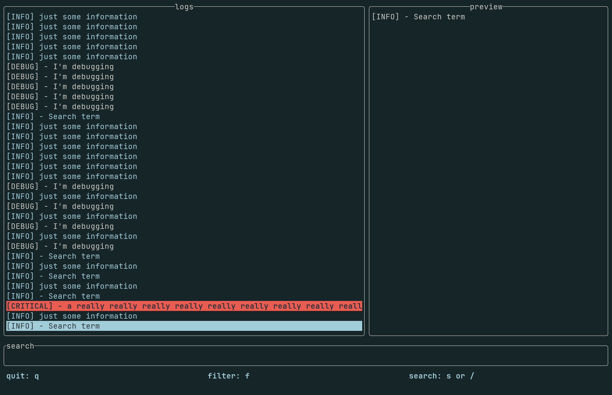

# Log Viewer
Welcome to my nifty log viewer. I wrote this in a day, so there are probably numerous
bugs.

 

## Install

Prerequisites: [cargo and rust](https://doc.rust-lang.org/book/ch01-01-installation.html) 

To install package use cargo to build and install the repo.
```bash
git clone https://github.com/MikeWelsh801/log_view
cargo install --path ./log_view
```

## Run
To run the application:
```bash
log_viewer <Path-to-your-log-file>
```

> [NOTE]
> The log viewer assumes you're logs contain log levels (INFO, WARNING, ERROR, 
CRITICAL) in all caps somewhere in the log. If this is not the case, filtering 
will not work, but you can still scroll and search the logs.
